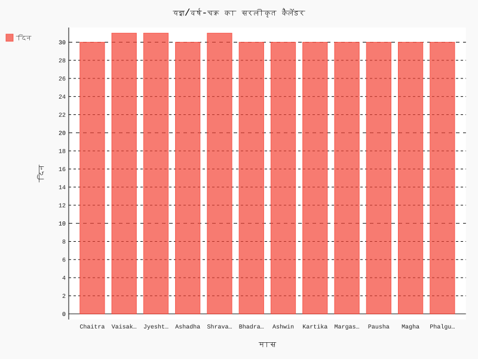

# वैदिक युग (Vedic Era)

## अवलोकन
यह अध्याय चारों वेदों, वेदाङ्गों, और वैदिक अनुशंगिक साहित्य से विज्ञान, खगोल, चिकित्सा और गणितीय सिद्धांतों की संक्षिप्त पहचान कराएगा, और उदाहरणों के साथ उनके प्रभाव का अध्ययन करेगा [@macdonell1897; @keith1925].

## वैदिक साहित्य में ज्ञान-सूत्र
### उदाहरण: ऋग्वेद मंत्र
- देवनागरी:
  अग्निमीळे पुरोहितं यज्ञस्य देवम् ऋत्विजम्। होतारं रत्नधातमम्॥ (ऋग्वेद 1.1.1)
- IAST:
  agnim īḷe purohitaṃ yajñasya devaṃ ṛtvijam | hotāraṃ ratnadhātamam ||
- अनुवाद (Griffith):
  "I laud Agni, the chosen Priest, God, minister of sacrifice, the hotar, lavishest of wealth." [@rigveda-griffith]
- व्याकरणिक टिप्पणी:
  "अग्निम्" (द्वितीया एकवचन), "ईळे" धातु √īḍ (स्तुतौ), "पुरोहितम्" विशेषण। प्रारम्भिक वैदिक अनुष्ठान-व्यवस्था में अग्नि का वैज्ञानिक-रूपक—ऊर्जा/ऊष्मागतिक दृष्टि से प्रतीकात्मक पठन पर विमर्श संभव।

### वैदिक गणित की तकनीकें
- प्रणयन-प्रक्रियाओं और शुल्बसूत्रों में ज्यामितीय निर्मिति (समकोण निर्माण, कर्ण-प्रमेय) [@baudhayana; @apastamba].
- मानसिक गणना/संख्यात्मक अलंकार का प्रारूप और बाद के भारतीय गणित पर प्रभाव [@jha2009].

### खगोल और यज्ञ कैलेंडर
- नक्षत्र-सूची, यज्ञ-काल निर्धारण, और प्रेक्षण-आधारित समायोजन [@sarma2008].
- ग्रहण-प्रेक्षण और पंचांग परंपरा के बीज।

### आयुर्वेद की मूल संरचना
- धन्वंतरि परंपरा, चरक संहिता (चिकित्सा-सूत्र), सुश्रुत संहिता (शल्य-तंत्र) [@charaka-sharma; @sushruta-bhishagratna].

## डेटा-आधारित चित्र
- चित्र: `assets/images/vedic_calendar.svg`
- डेटा: `data/vedic_calendar.csv`

## संक्षेप
- वैदिक साहित्य में आचार-सूत्रों के साथ-साथ गणित/खगोल/चिकित्सा के बीज-रूप स्पष्ट दिखाई देते हैं।