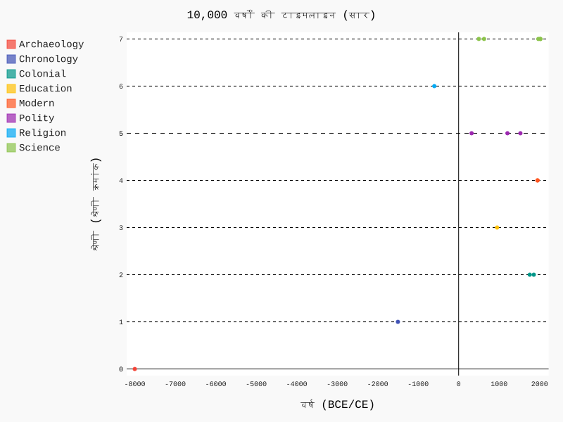
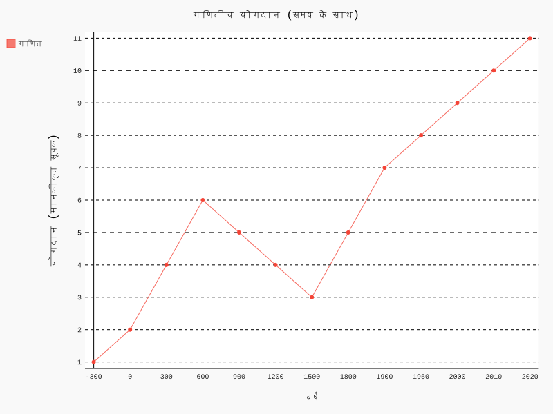
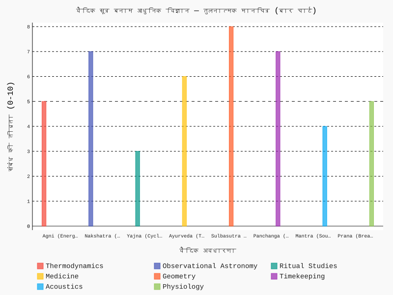

# चार्ट, ग्राफ़ और टाइमलाइन

## 10,000 वर्षों की टाइमलाइन
- डेटा: `data/timeline.csv`

## विषयवार सांख्यिकी
- डेटा: `data/maths_contributions.csv`

## वैदिक मंत्र और आधुनिक विज्ञान का तुलनात्मक मानचित्र
- डेटा: `data/vedic_modern_map.csv`

## पुनरुत्पादन और आगे के डेटा सेट
- प्रत्येक चित्र `scripts/generate_charts.py` से जनित; CSV में स्रोत/तिथि/लाइसेंस फ़ील्ड जोड़ें।
- नियोजित डेटा: `data/astronomy_tables.csv`, `data/university_networks.csv`, `data/metallurgy_cases.csv` (आगामी संस्करण)।

## संक्षेप
- सभी चित्र पुनरुत्पादन योग्य हैं; पाठक चाहें तो डेटा में संशोधन कर वैकल्पिक आरेख बना सकते हैं।